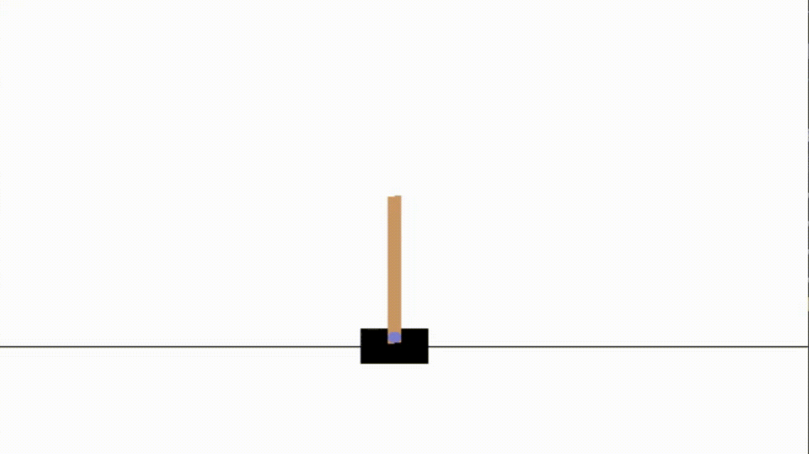

# CartPoleGA
Solving OpenAI Gym CartPole with an genetic algorithm and a neural network.

The neural network required to solve cartpole using this approach is very small:

## Approach

A population of DNA (neural network weights) is trialed over multiple generations. At each generationg the fittest are selected from the population, the fittest are then crossed over and mutated with some probability.

## Performance 

Depending on the random initialisation of the population this approach will converge to a solution in anything from 15 to 35 generations (from empirical testing).

## Example

Here is an example of the fittest member of the population achieving a score of over 1000 despite the training process stopping at a score of 200:

## Interesting Observations

It would appear that even with a population of 100 there would often be an individual in the initial population that would achieve a score of 200 despite the weights being random.
